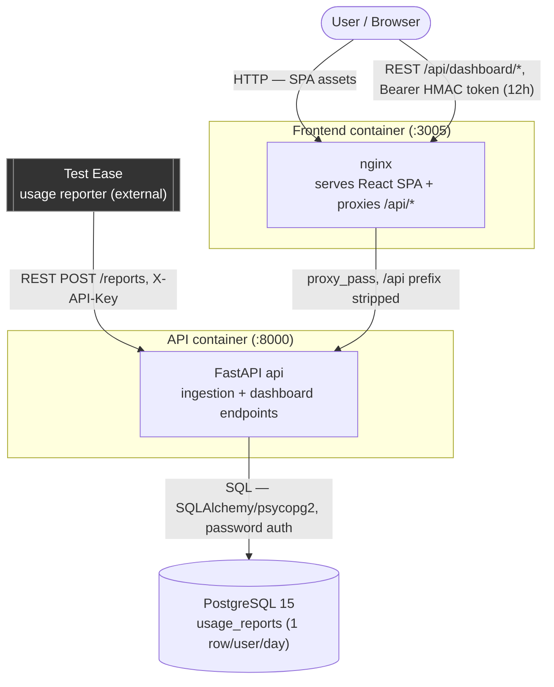

# System Architecture Diagram

This diagram shows TestEase Usage Tracker's internal components, the direction data flows
between them, and how it reaches its one external dependency: **Test Ease**.

## How it connects to Test Ease

Test Ease is the sole ingestion client and the only system TestEase Usage Tracker depends
on but doesn't own. It POSTs each user's **running daily totals** (not per-action
events) to `POST /reports` on a fixed interval, authenticated with a shared
`X-API-Key` header; each report **upserts** one row per user per day. The
dashboard never talks to Postgres directly — it reads aggregates through the same
FastAPI service, authenticated separately with an HMAC-signed 12h Bearer token.

## Diagram

**Reading the diagram:**

- Solid arrows = request/command direction; responses return along the same edge (everything here is synchronous request/response — no queues or polling).
- Dark boxes = external systems this app depends on but doesn't control.
- Postgres is internal-only (no published port); the API is its single client.
